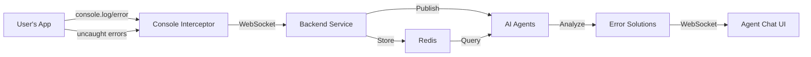

# Console & Error Capture Implementation Guide

## Overview

This document provides detailed implementation instructions for the **critical** console and error capture system that enables AI agents to see and debug JavaScript errors in real-time, similar to Replit's implementation.

## Why This Is Critical

1. **AI Debugging**: AI agents can only help debug what they can see
2. **Real-time Feedback**: Immediate error detection enables instant fixes
3. **Context Awareness**: Console logs provide context about application state
4. **User Experience**: Users expect AI to understand their errors automatically

## Architecture



## Implementation Details

### 1. Frontend Implementation

#### Console Interceptor Service
```typescript
// frontend/src/services/console-interceptor.ts
import { debounce } from 'lodash';

interface ConsoleMessage {
  type: 'console' | 'error' | 'unhandledRejection';
  level?: string;
  method?: string;
  args?: any[];
  message?: string;
  stack?: string;
  filename?: string;
  lineno?: number;
  colno?: number;
  timestamp: string;
  userAgent: string;
  url: string;
}

export class ConsoleInterceptor {
  private originalConsole: Console;
  private ws: WebSocket | null = null;
  private messageQueue: ConsoleMessage[] = [];
  private isConnected = false;
  private reconnectTimeout: NodeJS.Timeout | null = null;
  private projectId: string;
  private maxReconnectAttempts = 5;
  private reconnectAttempts = 0;

  constructor(projectId: string, wsUrl: string) {
    this.projectId = projectId;
    this.originalConsole = { ...console };
    this.connectWebSocket(wsUrl);
    this.interceptConsoleMethods();
    this.setupGlobalErrorHandlers();
    this.setupNetworkErrorInterception();
  }

  private connectWebSocket(wsUrl: string) {
    try {
      this.ws = new WebSocket(`${wsUrl}/console/${this.projectId}`);
      
      this.ws.onopen = () => {
        this.isConnected = true;
        this.reconnectAttempts = 0;
        this.flushMessageQueue();
      };

      this.ws.onclose = () => {
        this.isConnected = false;
        this.scheduleReconnect(wsUrl);
      };

      this.ws.onerror = (error) => {
        this.originalConsole.error('Console interceptor WebSocket error:', error);
      };
    } catch (error) {
      this.originalConsole.error('Failed to create WebSocket:', error);
    }
  }

  private interceptConsoleMethods() {
    const methods: (keyof Console)[] = ['log', 'error', 'warn', 'info', 'debug', 'trace', 'table', 'dir'];
    
    methods.forEach(method => {
      (console as any)[method] = (...args: any[]) => {
        // Always call original method first
        (this.originalConsole as any)[method](...args);
        
        // Send to backend
        this.captureConsoleMessage({
          type: 'console',
          method,
          args: this.serializeArgs(args),
          timestamp: new Date().toISOString(),
          stack: this.getStackTrace(),
          userAgent: navigator.userAgent,
          url: window.location.href
        });
      };
    });
  }

  private setupGlobalErrorHandlers() {
    // Catch syntax errors and runtime errors
    window.addEventListener('error', (event: ErrorEvent) => {
      this.captureConsoleMessage({
        type: 'error',
        message: event.message,
        filename: event.filename,
        lineno: event.lineno,
        colno: event.colno,
        stack: event.error?.stack,
        timestamp: new Date().toISOString(),
        userAgent: navigator.userAgent,
        url: window.location.href
      });

      // Prevent default error handling
      event.preventDefault();
    });

    // Catch unhandled promise rejections
    window.addEventListener('unhandledrejection', (event: PromiseRejectionEvent) => {
      this.captureConsoleMessage({
        type: 'unhandledRejection',
        message: event.reason?.message || String(event.reason),
        stack: event.reason?.stack,
        timestamp: new Date().toISOString(),
        userAgent: navigator.userAgent,
        url: window.location.href
      });

      // Prevent default error handling
      event.preventDefault();
    });
  }

  private setupNetworkErrorInterception() {
    // Intercept fetch errors
    const originalFetch = window.fetch;
    window.fetch = async (...args) => {
      try {
        const response = await originalFetch(...args);
        if (!response.ok) {
          this.captureConsoleMessage({
            type: 'console',
            method: 'error',
            args: [`Network request failed: ${response.status} ${response.statusText}`, args[0]],
            timestamp: new Date().toISOString(),
            userAgent: navigator.userAgent,
            url: window.location.href
          });
        }
        return response;
      } catch (error) {
        this.captureConsoleMessage({
          type: 'console',
          method: 'error',
          args: ['Network request failed:', error, args[0]],
          timestamp: new Date().toISOString(),
          userAgent: navigator.userAgent,
          url: window.location.href
        });
        throw error;
      }
    };

    // Intercept XMLHttpRequest errors
    const originalXHROpen = XMLHttpRequest.prototype.open;
    XMLHttpRequest.prototype.open = function(...args: any[]) {
      this.addEventListener('error', () => {
        window.console.error('XMLHttpRequest failed:', args[1]);
      });
      return originalXHROpen.apply(this, args as any);
    };
  }

  private serializeArgs(args: any[]): any[] {
    return args.map(arg => {
      try {
        if (arg instanceof Error) {
          return {
            name: arg.name,
            message: arg.message,
            stack: arg.stack
          };
        } else if (typeof arg === 'object' && arg !== null) {
          // Handle circular references
          return JSON.parse(JSON.stringify(arg, this.getCircularReplacer()));
        }
        return arg;
      } catch (error) {
        return String(arg);
      }
    });
  }

  private getCircularReplacer() {
    const seen = new WeakSet();
    return (key: string, value: any) => {
      if (typeof value === 'object' && value !== null) {
        if (seen.has(value)) {
          return '[Circular Reference]';
        }
        seen.add(value);
      }
      return value;
    };
  }

  private getStackTrace(): string {
    const error = new Error();
    return error.stack || '';
  }

  private captureConsoleMessage(message: ConsoleMessage) {
    if (this.isConnected && this.ws?.readyState === WebSocket.OPEN) {
      this.ws.send(JSON.stringify(message));
    } else {
      // Queue messages if not connected
      this.messageQueue.push(message);
      if (this.messageQueue.length > 100) {
        this.messageQueue.shift(); // Remove oldest message
      }
    }
  }

  private flushMessageQueue() {
    while (this.messageQueue.length > 0 && this.isConnected) {
      const message = this.messageQueue.shift();
      if (message && this.ws?.readyState === WebSocket.OPEN) {
        this.ws.send(JSON.stringify(message));
      }
    }
  }

  private scheduleReconnect(wsUrl: string) {
    if (this.reconnectAttempts >= this.maxReconnectAttempts) {
      this.originalConsole.error('Max reconnection attempts reached');
      return;
    }

    const delay = Math.min(1000 * Math.pow(2, this.reconnectAttempts), 30000);
    this.reconnectAttempts++;

    this.reconnectTimeout = setTimeout(() => {
      this.connectWebSocket(wsUrl);
    }, delay);
  }

  public destroy() {
    // Restore original console methods
    Object.assign(console, this.originalConsole);
    
    // Close WebSocket
    if (this.ws) {
      this.ws.close();
    }

    // Clear reconnect timeout
    if (this.reconnectTimeout) {
      clearTimeout(this.reconnectTimeout);
    }
  }
}
```

#### Integration with Preview IFrame
```typescript
// frontend/src/components/preview/PreviewPane.tsx
import { useEffect, useRef } from 'react';
import { ConsoleInterceptor } from '@/services/console-interceptor';

export const PreviewPane: React.FC<{ projectId: string }> = ({ projectId }) => {
  const iframeRef = useRef<HTMLIFrameElement>(null);
  const interceptorRef = useRef<ConsoleInterceptor | null>(null);

  useEffect(() => {
    if (iframeRef.current) {
      // Inject console interceptor into iframe
      const iframeWindow = iframeRef.current.contentWindow;
      if (iframeWindow) {
        // Create script to inject interceptor
        const script = iframeWindow.document.createElement('script');
        script.textContent = `
          ${ConsoleInterceptor.toString()}
          window.__consoleInterceptor = new ConsoleInterceptor(
            '${projectId}',
            '${import.meta.env.VITE_WS_URL}'
          );
        `;
        iframeWindow.document.head.appendChild(script);
      }
    }

    return () => {
      // Cleanup
      if (interceptorRef.current) {
        interceptorRef.current.destroy();
      }
    };
  }, [projectId]);

  return (
    <iframe
      ref={iframeRef}
      src={`/preview/${projectId}`}
      className="w-full h-full border-0"
      sandbox="allow-scripts allow-same-origin allow-modals allow-popups"
    />
  );
};
```

### 2. Backend Implementation

#### WebSocket Handler
```python
# backend/api/websocket/console_handler.py
from fastapi import WebSocket, WebSocketDisconnect, Depends
from typing import Dict, Set
import json
import asyncio
from services.console_service import ConsoleService
from services.agent_orchestrator import AgentOrchestrator

class ConsoleWebSocketManager:
    def __init__(self):
        self.active_connections: Dict[str, Set[WebSocket]] = {}
        self.console_service = ConsoleService()
        self.agent_orchestrator = AgentOrchestrator()
    
    async def connect(self, websocket: WebSocket, project_id: str):
        await websocket.accept()
        if project_id not in self.active_connections:
            self.active_connections[project_id] = set()
        self.active_connections[project_id].add(websocket)
    
    def disconnect(self, websocket: WebSocket, project_id: str):
        if project_id in self.active_connections:
            self.active_connections[project_id].discard(websocket)
            if not self.active_connections[project_id]:
                del self.active_connections[project_id]
    
    async def handle_console_message(self, websocket: WebSocket, project_id: str):
        try:
            while True:
                data = await websocket.receive_text()
                message = json.loads(data)
                
                # Store in Redis
                await self.console_service.store_console_log(project_id, message)
                
                # Check if it's an error that needs immediate attention
                if message['type'] in ['error', 'unhandledRejection']:
                    await self.trigger_ai_debugging(project_id, message)
                
                # Broadcast to other connected clients (for console UI)
                await self.broadcast_to_project(project_id, message, exclude=websocket)
                
        except WebSocketDisconnect:
            self.disconnect(websocket, project_id)
        except Exception as e:
            print(f"Error handling console message: {e}")
            self.disconnect(websocket, project_id)
    
    async def trigger_ai_debugging(self, project_id: str, error_message: dict):
        """Trigger AI agents to analyze and fix errors"""
        # Get recent console context
        context = await self.console_service.get_error_context(project_id)
        
        # Create debugging task for AI agents
        task = {
            "type": "debug_error",
            "project_id": project_id,
            "error": error_message,
            "context": context,
            "priority": "high"
        }
        
        # Send to agent orchestrator
        await self.agent_orchestrator.create_debugging_task(task)
    
    async def broadcast_to_project(self, project_id: str, message: dict, exclude: WebSocket = None):
        if project_id in self.active_connections:
            disconnected = set()
            for connection in self.active_connections[project_id]:
                if connection != exclude:
                    try:
                        await connection.send_text(json.dumps(message))
                    except:
                        disconnected.add(connection)
            
            # Clean up disconnected clients
            for conn in disconnected:
                self.disconnect(conn, project_id)

console_manager = ConsoleWebSocketManager()

@router.websocket("/console/{project_id}")
async def console_websocket_endpoint(
    websocket: WebSocket,
    project_id: str,
    current_user = Depends(get_current_user_ws)
):
    # Verify user has access to project
    if not await verify_project_access(current_user, project_id):
        await websocket.close(code=4003, reason="Unauthorized")
        return
    
    await console_manager.connect(websocket, project_id)
    await console_manager.handle_console_message(websocket, project_id)
```

#### Console Service with AI Integration
```python
# backend/services/console_service.py
import json
import time
from typing import List, Dict, Optional
from redis import Redis
import re

class ConsoleService:
    def __init__(self, redis_client: Redis):
        self.redis = redis_client
        self.max_logs_per_project = 1000
        self.error_pattern_matchers = [
            (r"Cannot read prop(?:erty|erties) '(\w+)' of null", "null_reference"),
            (r"Cannot read prop(?:erty|erties) '(\w+)' of undefined", "undefined_reference"),
            (r"(\w+) is not defined", "reference_error"),
            (r"Unexpected token (\w+)", "syntax_error"),
            (r"Failed to fetch", "network_error"),
            (r"CORS", "cors_error"),
            (r"404", "not_found_error"),
            (r"500", "server_error"),
        ]
    
    async def store_console_log(self, project_id: str, log_data: dict):
        """Store console log in Redis with metadata"""
        key = f"console:{project_id}"
        error_key = f"console:errors:{project_id}"
        
        # Add metadata
        log_data['id'] = f"{project_id}:{time.time_ns()}"
        log_data['stored_at'] = time.time()
        
        # Detect error patterns
        if log_data['type'] in ['error', 'unhandledRejection']:
            log_data['error_type'] = self.classify_error(log_data)
            
            # Store in error-specific list
            await self.redis.zadd(error_key, {
                json.dumps(log_data): time.time()
            })
            await self.redis.expire(error_key, 86400)  # 24 hours
        
        # Store in main console log
        await self.redis.zadd(key, {
            json.dumps(log_data): time.time()
        })
        
        # Maintain sliding window
        await self.redis.zremrangebyrank(key, 0, -self.max_logs_per_project-1)
        await self.redis.expire(key, 86400)  # 24 hours
        
        # Publish to subscribers (AI agents)
        channel = f"agent:console:{project_id}"
        await self.redis.publish(channel, json.dumps(log_data))
    
    def classify_error(self, log_data: dict) -> str:
        """Classify error type for better AI understanding"""
        error_text = str(log_data.get('message', '')) + str(log_data.get('stack', ''))
        
        for pattern, error_type in self.error_pattern_matchers:
            if re.search(pattern, error_text, re.IGNORECASE):
                return error_type
        
        return 'unknown_error'
    
    async def get_recent_logs(self, project_id: str, count: int = 100) -> List[Dict]:
        """Get recent console logs for AI analysis"""
        key = f"console:{project_id}"
        logs = await self.redis.zrevrange(key, 0, count-1)
        return [json.loads(log) for log in logs]
    
    async def get_error_context(self, project_id: str) -> Dict:
        """Get comprehensive error context for AI debugging"""
        # Get recent errors
        error_key = f"console:errors:{project_id}"
        recent_errors = await self.redis.zrevrange(error_key, 0, 9)  # Last 10 errors
        errors = [json.loads(error) for error in recent_errors]
        
        # Get logs around each error (before and after)
        all_logs = await self.get_recent_logs(project_id, 200)
        
        error_contexts = []
        for error in errors:
            error_time = error['stored_at']
            
            # Find logs within 5 seconds before and after the error
            context_logs = [
                log for log in all_logs
                if abs(log['stored_at'] - error_time) <= 5
            ]
            
            error_contexts.append({
                'error': error,
                'context_logs': context_logs,
                'error_type': error.get('error_type', 'unknown')
            })
        
        # Get overall statistics
        stats = await self.get_console_stats(project_id)
        
        return {
            'recent_errors': errors,
            'error_contexts': error_contexts,
            'statistics': stats,
            'has_critical_errors': any(e.get('error_type') in ['null_reference', 'undefined_reference', 'syntax_error'] for e in errors)
        }
    
    async def get_console_stats(self, project_id: str) -> Dict:
        """Get console statistics for AI analysis"""
        logs = await self.get_recent_logs(project_id, 1000)
        
        stats = {
            'total_logs': len(logs),
            'errors': len([l for l in logs if l['type'] == 'error']),
            'warnings': len([l for l in logs if l.get('method') == 'warn']),
            'info': len([l for l in logs if l.get('method') == 'info']),
            'debug': len([l for l in logs if l.get('method') == 'debug']),
            'unhandled_rejections': len([l for l in logs if l['type'] == 'unhandledRejection']),
            'network_errors': len([l for l in logs if 'fetch' in str(l).lower()]),
        }
        
        return stats
```

### 3. AI Agent Integration

#### Enhanced Base Agent with Console Awareness
```python
# backend/agents/base_agent.py
from abc import ABC, abstractmethod
from typing import Dict, List, Optional
import json

class BaseAgent(ABC):
    def __init__(self, console_service, llm_client):
        self.console_service = console_service
        self.llm_client = llm_client
    
    async def analyze_console_errors(self, project_id: str) -> Dict:
        """Analyze console errors and provide solutions"""
        context = await self.console_service.get_error_context(project_id)
        
        if not context['recent_errors']:
            return {'has_errors': False}
        
        # Prepare error analysis prompt
        error_summary = self._format_errors_for_llm(context['recent_errors'])
        context_logs = self._format_context_logs(context['error_contexts'])
        
        prompt = f"""
        Analyze these JavaScript errors and provide solutions:
        
        ERRORS:
        {error_summary}
        
        CONSOLE CONTEXT (logs around errors):
        {context_logs}
        
        For each error:
        1. Identify the root cause
        2. Provide a specific code fix
        3. Explain why the error occurred
        4. Suggest preventive measures
        
        Format your response as JSON with this structure:
        {{
            "errors": [
                {{
                    "error_id": "...",
                    "root_cause": "...",
                    "fix": {{
                        "description": "...",
                        "code": "...",
                        "file_path": "..."
                    }},
                    "explanation": "...",
                    "prevention": "..."
                }}
            ],
            "general_recommendations": ["..."]
        }}
        """
        
        response = await self.llm_client.complete(
            prompt,
            model="claude-sonnet-4",  # Use fast model for debugging
            temperature=0.2,
            max_tokens=2000
        )
        
        return {
            'has_errors': True,
            'analysis': json.loads(response),
            'error_count': len(context['recent_errors']),
            'critical': context['has_critical_errors']
        }
    
    def _format_errors_for_llm(self, errors: List[Dict]) -> str:
        """Format errors for LLM analysis"""
        formatted = []
        for i, error in enumerate(errors):
            formatted.append(f"""
Error {i+1}:
- Type: {error.get('type')}
- Message: {error.get('message')}
- File: {error.get('filename', 'unknown')}
- Line: {error.get('lineno', 'unknown')}
- Column: {error.get('colno', 'unknown')}
- Stack: {error.get('stack', 'No stack trace')}
- Error Classification: {error.get('error_type', 'unknown')}
            """)
        return "\n".join(formatted)
    
    def _format_context_logs(self, error_contexts: List[Dict]) -> str:
        """Format console logs around errors"""
        formatted = []
        for ctx in error_contexts:
            logs_before = [l for l in ctx['context_logs'] if l['stored_at'] < ctx['error']['stored_at']]
            logs_after = [l for l in ctx['context_logs'] if l['stored_at'] > ctx['error']['stored_at']]
            
            formatted.append(f"""
Context for error: {ctx['error'].get('message')}
Logs before error:
{self._format_logs(logs_before[-5:])}  # Last 5 logs before error

Logs after error:
{self._format_logs(logs_after[:5])}  # First 5 logs after error
            """)
        return "\n".join(formatted)
    
    def _format_logs(self, logs: List[Dict]) -> str:
        """Format console logs for display"""
        return "\n".join([
            f"  [{log.get('method', 'log')}] {log.get('args', [])}"
            for log in logs
            if log.get('type') == 'console'
        ])
```

#### Engineer Agent with Auto-Fix Capability
```python
# backend/agents/engineer_agent.py
from agents.base_agent import BaseAgent
import json

class EngineerAgent(BaseAgent):
    async def auto_fix_errors(self, project_id: str, file_content: str, file_path: str) -> Dict:
        """Automatically fix errors based on console output"""
        # Get error analysis
        analysis = await self.analyze_console_errors(project_id)
        
        if not analysis['has_errors']:
            return {'success': True, 'message': 'No errors to fix'}
        
        # Apply fixes
        fixed_content = file_content
        fixes_applied = []
        
        for error_fix in analysis['analysis']['errors']:
            if error_fix['fix']['file_path'] == file_path:
                # Apply the fix
                fixed_content = self._apply_fix(
                    fixed_content,
                    error_fix['fix']['code'],
                    error_fix['error_id']
                )
                fixes_applied.append(error_fix)
        
        return {
            'success': True,
            'fixed_content': fixed_content,
            'fixes_applied': fixes_applied,
            'message': f"Applied {len(fixes_applied)} fixes"
        }
    
    def _apply_fix(self, content: str, fix_code: str, error_id: str) -> str:
        """Apply a specific fix to the code"""
        # This is a simplified version - in reality, you'd use AST parsing
        # or more sophisticated code modification
        return content  # Implement actual fix application
```

### 4. UI Components for Console Display

#### Console Output Component
```typescript
// frontend/src/components/console/ConsoleOutput.tsx
import React, { useEffect, useState, useRef } from 'react';
import { ScrollArea } from '@/components/ui/scroll-area';
import { Input } from '@/components/ui/input';
import { Button } from '@/components/ui/button';
import { Badge } from '@/components/ui/badge';
import { Filter, Trash2, Download, Search } from 'lucide-react';
import { useWebSocket } from '@/hooks/useWebSocket';
import { cn } from '@/lib/utils';

interface ConsoleMessage {
  id: string;
  type: 'console' | 'error' | 'unhandledRejection';
  method?: string;
  args?: any[];
  message?: string;
  timestamp: string;
  stack?: string;
  filename?: string;
  lineno?: number;
  colno?: number;
}

interface ConsoleOutputProps {
  projectId: string;
  onErrorClick?: (error: ConsoleMessage) => void;
}

export const ConsoleOutput: React.FC<ConsoleOutputProps> = ({ projectId, onErrorClick }) => {
  const [messages, setMessages] = useState<ConsoleMessage[]>([]);
  const [filter, setFilter] = useState<string>('all');
  const [searchTerm, setSearchTerm] = useState('');
  const scrollRef = useRef<HTMLDivElement>(null);
  const { subscribe } = useWebSocket();

  useEffect(() => {
    // Subscribe to console messages
    const unsubscribe = subscribe(`console:${projectId}`, (message: ConsoleMessage) => {
      setMessages(prev => [...prev, message].slice(-500)); // Keep last 500 messages
    });

    // Load initial messages
    fetchConsoleHistory();

    return unsubscribe;
  }, [projectId]);

  useEffect(() => {
    // Auto-scroll to bottom
    if (scrollRef.current) {
      scrollRef.current.scrollTop = scrollRef.current.scrollHeight;
    }
  }, [messages]);

  const fetchConsoleHistory = async () => {
    try {
      const response = await fetch(`/api/projects/${projectId}/console`);
      const data = await response.json();
      setMessages(data.logs);
    } catch (error) {
      console.error('Failed to fetch console history:', error);
    }
  };

  const filteredMessages = messages.filter(msg => {
    // Filter by type
    if (filter !== 'all') {
      if (filter === 'errors' && msg.type !== 'error' && msg.method !== 'error') return false;
      if (filter === 'warnings' && msg.method !== 'warn') return false;
      if (filter === 'info' && msg.method !== 'info') return false;
      if (filter === 'debug' && msg.method !== 'debug') return false;
    }

    // Filter by search term
    if (searchTerm) {
      const searchLower = searchTerm.toLowerCase();
      const messageText = JSON.stringify(msg).toLowerCase();
      return messageText.includes(searchLower);
    }

    return true;
  });

  const getMessageColor = (msg: ConsoleMessage) => {
    if (msg.type === 'error' || msg.method === 'error') return 'text-red-500';
    if (msg.type === 'unhandledRejection') return 'text-red-600';
    if (msg.method === 'warn') return 'text-yellow-500';
    if (msg.method === 'info') return 'text-blue-500';
    if (msg.method === 'debug') return 'text-gray-500';
    return 'text-foreground';
  };

  const formatArgs = (args: any[]): string => {
    return args.map(arg => {
      if (typeof arg === 'object') {
        return JSON.stringify(arg, null, 2);
      }
      return String(arg);
    }).join(' ');
  };

  const clearConsole = () => {
    setMessages([]);
  };

  const exportLogs = () => {
    const logs = JSON.stringify(messages, null, 2);
    const blob = new Blob([logs], { type: 'application/json' });
    const url = URL.createObjectURL(blob);
    const a = document.createElement('a');
    a.href = url;
    a.download = `console-${projectId}-${Date.now()}.json`;
    a.click();
    URL.revokeObjectURL(url);
  };

  return (
    <div className="flex flex-col h-full bg-background">
      {/* Header */}
      <div className="flex items-center gap-2 p-2 border-b">
        <Input
          placeholder="Search console..."
          value={searchTerm}
          onChange={(e) => setSearchTerm(e.target.value)}
          className="flex-1"
          prefix={<Search className="w-4 h-4" />}
        />
        
        <div className="flex items-center gap-1">
          <Button
            size="sm"
            variant={filter === 'all' ? 'default' : 'ghost'}
            onClick={() => setFilter('all')}
          >
            All
          </Button>
          <Button
            size="sm"
            variant={filter === 'errors' ? 'default' : 'ghost'}
            onClick={() => setFilter('errors')}
          >
            Errors
          </Button>
          <Button
            size="sm"
            variant={filter === 'warnings' ? 'default' : 'ghost'}
            onClick={() => setFilter('warnings')}
          >
            Warnings
          </Button>
          <Button
            size="sm"
            variant={filter === 'info' ? 'default' : 'ghost'}
            onClick={() => setFilter('info')}
          >
            Info
          </Button>
        </div>

        <div className="flex items-center gap-1">
          <Button size="icon" variant="ghost" onClick={clearConsole}>
            <Trash2 className="w-4 h-4" />
          </Button>
          <Button size="icon" variant="ghost" onClick={exportLogs}>
            <Download className="w-4 h-4" />
          </Button>
        </div>
      </div>

      {/* Console Output */}
      <ScrollArea className="flex-1 p-2" ref={scrollRef}>
        <div className="font-mono text-xs space-y-1">
          {filteredMessages.map((msg) => (
            <div
              key={msg.id}
              className={cn(
                'group flex items-start gap-2 hover:bg-muted/50 p-1 rounded cursor-pointer',
                getMessageColor(msg)
              )}
              onClick={() => {
                if (msg.type === 'error' && onErrorClick) {
                  onErrorClick(msg);
                }
              }}
            >
              {/* Timestamp */}
              <span className="text-muted-foreground opacity-50">
                {new Date(msg.timestamp).toLocaleTimeString()}
              </span>

              {/* Method Badge */}
              {msg.method && (
                <Badge variant="outline" className="text-xs">
                  {msg.method}
                </Badge>
              )}

              {/* Message Content */}
              <div className="flex-1 whitespace-pre-wrap break-all">
                {msg.type === 'error' || msg.type === 'unhandledRejection' ? (
                  <div>
                    <div className="font-semibold">{msg.message}</div>
                    {msg.filename && (
                      <div className="text-xs opacity-70">
                        {msg.filename}:{msg.lineno}:{msg.colno}
                      </div>
                    )}
                    {msg.stack && (
                      <details className="mt-1">
                        <summary className="cursor-pointer text-xs opacity-70">
                          Stack trace
                        </summary>
                        <pre className="text-xs opacity-50 mt-1">{msg.stack}</pre>
                      </details>
                    )}
                  </div>
                ) : (
                  <div>{msg.args ? formatArgs(msg.args) : msg.message}</div>
                )}
              </div>
            </div>
          ))}
        </div>
      </ScrollArea>

      {/* Status Bar */}
      <div className="flex items-center justify-between px-2 py-1 border-t text-xs text-muted-foreground">
        <span>{filteredMessages.length} messages</span>
        <span>
          {messages.filter(m => m.type === 'error' || m.method === 'error').length} errors
        </span>
      </div>
    </div>
  );
};
```

## Testing Strategy

### Unit Tests for Console Interceptor
```typescript
// frontend/src/services/__tests__/console-interceptor.test.ts
import { ConsoleInterceptor } from '../console-interceptor';
import WS from 'jest-websocket-mock';

describe('ConsoleInterceptor', () => {
  let server: WS;
  let interceptor: ConsoleInterceptor;
  const projectId = 'test-project';
  const wsUrl = 'ws://localhost:8000';

  beforeEach(async () => {
    server = new WS(`${wsUrl}/console/${projectId}`);
    interceptor = new ConsoleInterceptor(projectId, wsUrl);
    await server.connected;
  });

  afterEach(() => {
    interceptor.destroy();
    WS.clean();
  });

  it('should capture console.log messages', async () => {
    console.log('test message', { data: 'test' });
    
    await expect(server).toReceiveMessage(
      expect.stringContaining('test message')
    );
  });

  it('should capture console.error messages', async () => {
    console.error('error message');
    
    await expect(server).toReceiveMessage(
      expect.stringContaining('error message')
    );
  });

  it('should capture unhandled errors', async () => {
    const error = new Error('Test error');
    const event = new ErrorEvent('error', {
      error,
      message: error.message,
      filename: 'test.js',
      lineno: 10,
      colno: 5
    });
    
    window.dispatchEvent(event);
    
    await expect(server).toReceiveMessage(
      expect.stringContaining('Test error')
    );
  });

  it('should capture unhandled promise rejections', async () => {
    const event = new PromiseRejectionEvent('unhandledrejection', {
      promise: Promise.reject('Test rejection'),
      reason: 'Test rejection'
    });
    
    window.dispatchEvent(event);
    
    await expect(server).toReceiveMessage(
      expect.stringContaining('Test rejection')
    );
  });

  it('should handle circular references in objects', () => {
    const circular: any = { a: 1 };
    circular.self = circular;
    
    console.log('circular test', circular);
    
    expect(() => {
      // Should not throw
    }).not.toThrow();
  });

  it('should queue messages when disconnected', async () => {
    server.close();
    
    console.log('queued message 1');
    console.log('queued message 2');
    
    // Reconnect
    server = new WS(`${wsUrl}/console/${projectId}`);
    await server.connected;
    
    // Should receive queued messages
    await expect(server).toReceiveMessage(
      expect.stringContaining('queued message 1')
    );
    await expect(server).toReceiveMessage(
      expect.stringContaining('queued message 2')
    );
  });
});
```

## Performance Considerations

1. **Message Batching**: For high-frequency logging, batch messages before sending
2. **Throttling**: Implement throttling for repetitive errors
3. **Compression**: Consider compressing large payloads
4. **Retention**: Automatically clean up old logs (24-hour retention)
5. **Filtering**: Allow filtering at source to reduce noise

## Security Considerations

1. **Sanitization**: Sanitize console output before display to prevent XSS
2. **Authentication**: Verify user access to project before allowing console access
3. **Rate Limiting**: Limit console message frequency to prevent abuse
4. **Sensitive Data**: Implement filtering for sensitive data in logs
5. **Encryption**: Use WSS (WebSocket Secure) in production

## Implementation Checklist

- [ ] Frontend console interceptor service
- [ ] WebSocket connection management
- [ ] Error classification system
- [ ] Backend console service
- [ ] Redis storage and pub/sub
- [ ] AI agent integration
- [ ] Console UI component
- [ ] Error navigation (click to source)
- [ ] Export functionality
- [ ] Unit tests
- [ ] Integration tests
- [ ] Performance optimization
- [ ] Security measures
- [ ] Documentation

This implementation ensures that AI agents have full visibility into JavaScript errors and console logs, enabling intelligent debugging assistance similar to Replit's capabilities. 